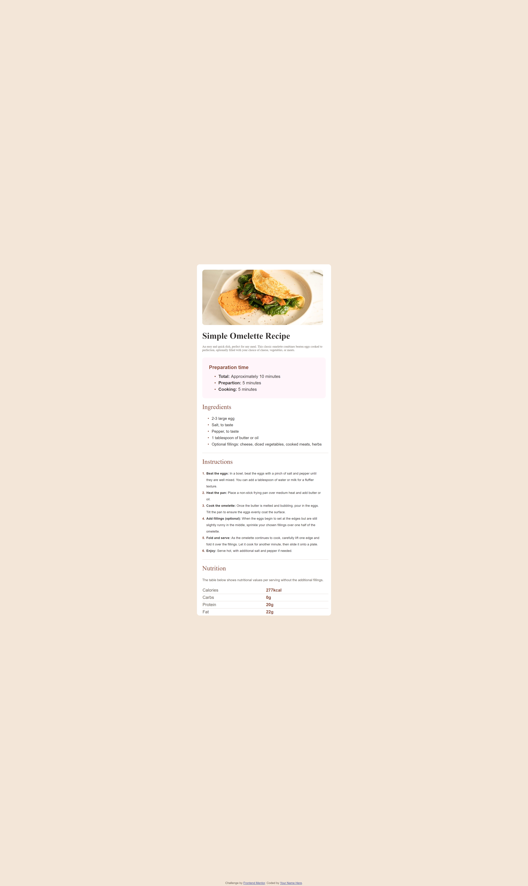

# Frontend Mentor - Recipe page solution

This is a solution to the [Recipe page challenge on Frontend Mentor](https://www.frontendmentor.io/challenges/recipe-page-KiTsR8QQKm). Frontend Mentor challenges help you improve your coding skills by building realistic projects. 

## Table of contents

- [Overview](#overview)
  - [The challenge](#the-challenge)
  - [Screenshot](#screenshot)
  - [Links](#links)
- [Author](#author)
- [Acknowledgments](#acknowledgments)

## Overview

### Screenshot

### Links

- Solution URL:(https://www.frontendmentor.io/solutions/recipepagemain-using-html-and-css-HocySIPn4z)
- Live Site URL: ()

## My process

### Built with

- Semantic HTML5 markup
- CSS custom properties
- Flexbox
- CSS Grid

- Frontend Mentor - [@Josh-codes](https://www.frontendmentor.io/profile/Josh-codes)
- Twitter - [@Joshua10080](https://www.twitter.com/Joshua10080)

